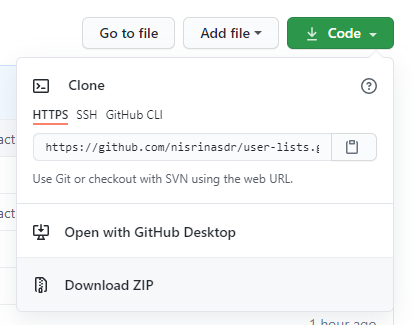

# Clone the app

## Download ZIP file
Download ZIP and then extract the zip.

## Git clone
If you already have installed GIT on your computer, use git clone:
> git clone https://github.com/nisrinasdr/user-lists.git

# PREREQUISITES
* [NodeJS](https://nodejs.org/en/)
* NPM

After successfully installed NodeJS, the next step is to install the npm. Open command prompt, change directory to the application folder, and run the following command:
> npm install

# INSTALLATION

## Run the app
Open command prompt and change directory to the application folder, run the following command afterward:

> npm start

The app will run in development mode. If the app did not appear automatically, open http://localhost:3000 on your browser.

## Run the test
To runs the test, run the following command:
> npm test